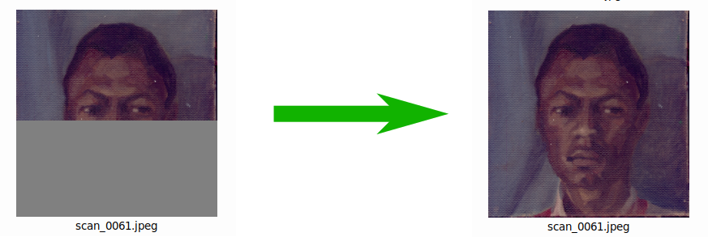

# Caja/Nautilus/Thunar Scripts
Some useful scripts written for myself. Maybe will be useful for you too.

## [Refresh Thumbnails](refresh_thumbs.sh)
Updates thumbnail of any thumbnailed file, or group of files. Needs *gio* as dependency. 
*Screenshot* 

## [SymLink to File](symlink2file.sh)
Converts symlink to it's original target.

## [Linkerator](linkerator.sh)
Transforms all selected (or typed as arguments in terminal) files to relative soft links of one file, that you are naming in zenity text-input dialog. Depends on package *zenity* You may freely edit it to depend on *YAD*.

# Caja/Nautilus only Scripts

## [Backup](backup.awk)
AWK script for making backups with current date/time in filename of files in ~/bak/{name_of_folder_with_files}.
Just select files, and apply this script. Time format is currently in Russian style.

## [Hard Link to next panel](hardlink_to_next_panel.awk)

AWK script. Works only with Nautilus and Caja. Makes hardlinks of selected files to next panel in double-panel window of Nautilus or Caja.