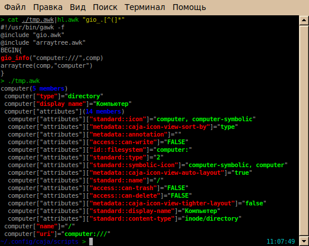
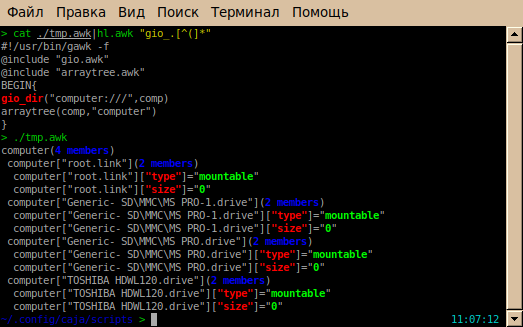
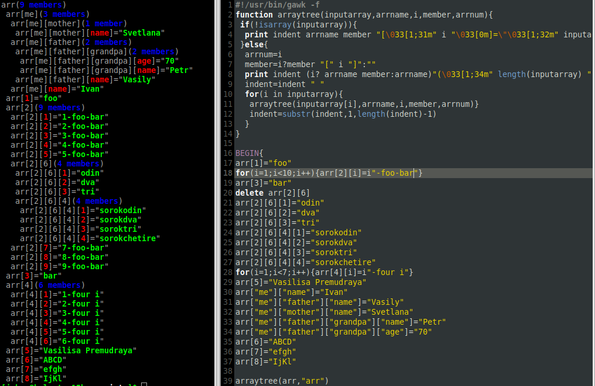
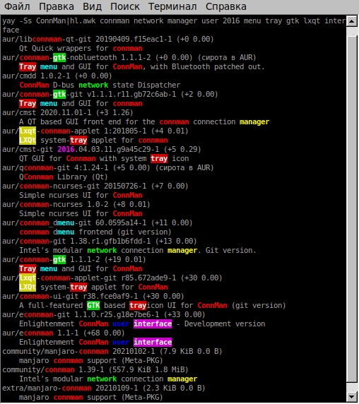
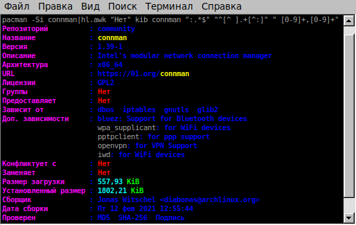
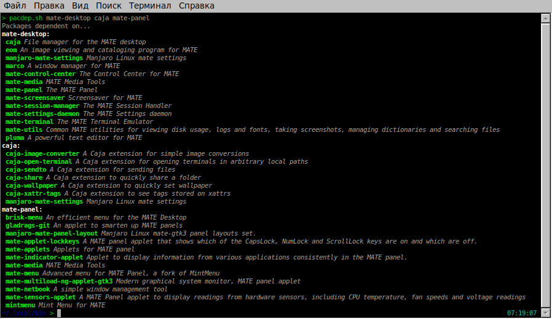
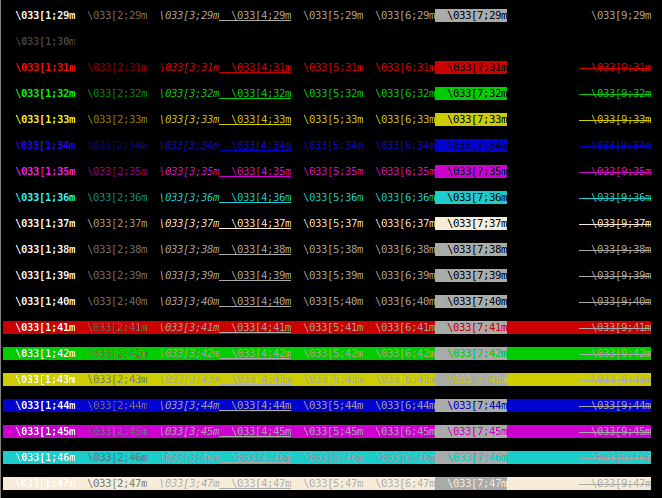
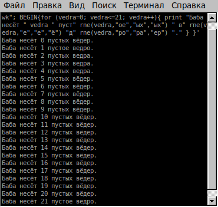
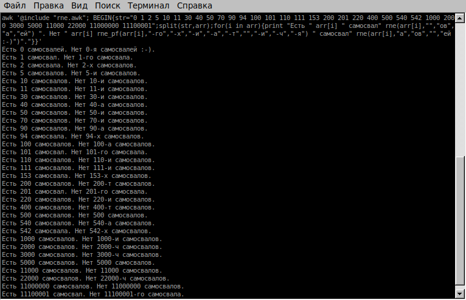

# Useful Scripts
**[ru] Полезные скрипты**
Some useful scripts written for myself. Maybe will be useful for you too.

# [GIO Functions](gio.awk)
GAWK Library for adding functions of converting some various GIO-info about files/locations such as **smb://192.168.8.1/share/photo.jpg** or **computer:///TOSHIBA HDWL120.drive**<br>
installation:<br>
1) Get awk @include library (AWKPATH built-in variable) by running:
```
gawk 'BEGIN{x=ENVIRON["AWKPATH"];gsub(":","\n",x);print x}'
```
2) Choose preferred path from list and create symlink:
```
ln -s gio.awk </chosen/path>
```
or:
```
cp gio.awk </chosen/path>
```
3) Usage:
```
#!/usr/bin/gawk -f
@include "gio.awk"
BEGIN{
gio_dir("computer:///",comp_list_array_all_attributes,"*")
gio_info("computer:///root.link",rootFS_icon_info)
}
```
*Screenshots:*<br>
<br>


## [Array Tree](arraytree.awk)
**[ru] Массив AWK в виде дерева.**<br>
GNU AWK script for exploring contents of a multi-dimensional associative array.<br> Example:
```
#!/usr/bin/gawk
@include "arraytree.awk"
BEGIN{
 arraytree(ENVIRON,"ENVIRON")
}
```
Installation and usage is the same as with *GIO Functions library*.<br>
*Screenshot:*<br>


## [HighLight](hl.awk)
**[ru]Выделение текста цветом**<br>
Script written on AWK for highlighting some text in command outputs by differrent colors.<br>
How to use:
```
hl.awk [word1] [word2]... file
```
or (example on screenshot)
```
yay -Ss ConnMan|hl.awk connman network manager user 2016 menu tray gtk lxqt interface
```
*Screenshot:*<br>
<p>
*Screenshot with regexp:*<br>


## [Reverse package dependency](pacdep.sh)
**[ru] Что зависит от пакета (pacman)**<br>
The script for finding reverse dependencies with pacman package manager.<br>
How to use:
```
pacdep.sh [PACKAGE1] [PACKAGE2]...
```

*Screenshot:*<br>


## [Test Colors](test_colors.awk "test_colors.awk")
**[ru] Проверка цветового вывода.**<br>
AWK script. Makes test of different color output of awk print.<br>
Syntax:<br>
`echo "text"|awk -f ./test_colors.awk`<br>
or:<br>
`echo "text"|./test_colors.awk`<br>
or:<br>
`./test_colors.awk <<< "text"`<br>
or:<br>
`awk -f ./test_colors.awk <<< "text"`<br>
*Screenshot:*<br>
<br>

## [Undivide](undivide.bc)
**[ru] Что на что поделили, чтобы ЭТО получилось.**<br>
Script written on arithmetical **BC** language for finding a closest dividing operation, that can make a floating point number.<br>For running directly -- just make script executable by: "`$chmod +x undivide.bc`", and edit variables: 'count', 'number' and 'afterdot'.<br>Usage in bash scripts:
```
#!/bin/bash
count=2000 #how many multipliers to test with number
number=3.14159265358979323846264338327950288419716939937508 #our number
afterdot=8 #limit of digits after dot
bc -q <<< $(sed 's/^count=.*$/count='$count'/g;s/^number=.*$/number='$number'/g;s/^afterdot=.*$/afterdot='$afterdot'/g;' ./undivide.bc)
```

## [Russian Number Endings](rne.awk)
**[ru] Русские окончания числительных.**<br>
AWK functions of obtaining Russian endings (or any parts of word) and postfixes of numerals, such as: "1 ведро, 2 ведра, 11 вёдер, об 1-м значке, о 2-х значках, о 2000-ах значков и т. д." <br>Functions:
```
rne(number,1_21_31,5-20_25-30,2-4_22-24,0)
rne_pf(number,for1,for2-4,for5-20,for40_90_100,for200-400,for1000,for2000-4000)
```
<br> How to use:
```
#!/usr/bin/gawk -f
@include "rne.awk"
BEGIN{
 for (vedra=0; vedra<=21; vedra++){
  print "Баба несёт " vedra " пуст" rne(vedra,"ое","ых","ых") " в" rne(vedra,"е","е","ё") "д" rne(vedra,"ро","ра","ер") "."
 }
}
```
Output:<br>
<br>
```
#!/usr/bin/gawk -f
@include "rne.awk"
BEGIN{
 str="0 1 2 5 10 11 30 40 50 70 90 94 100 101 110 111 153 200 201 220 400 500 540 542 1000 2000 3000 5000 11000 22000 11000000 11100001"
 split(str,arr)
 for(i in arr){
  print "Есть " arr[i] " самосвал" rne(arr[i],"","ов","а","ей") ". Нет " arr[i] rne_pf(arr[i],"-го","-х","-и","-а","-т","","-и","-ч","-я") " самосвал" rne(arr[i],"а","ов","","ей :-)")"."
 }
}
```
Output:<br>

