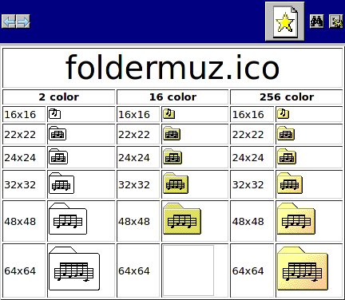
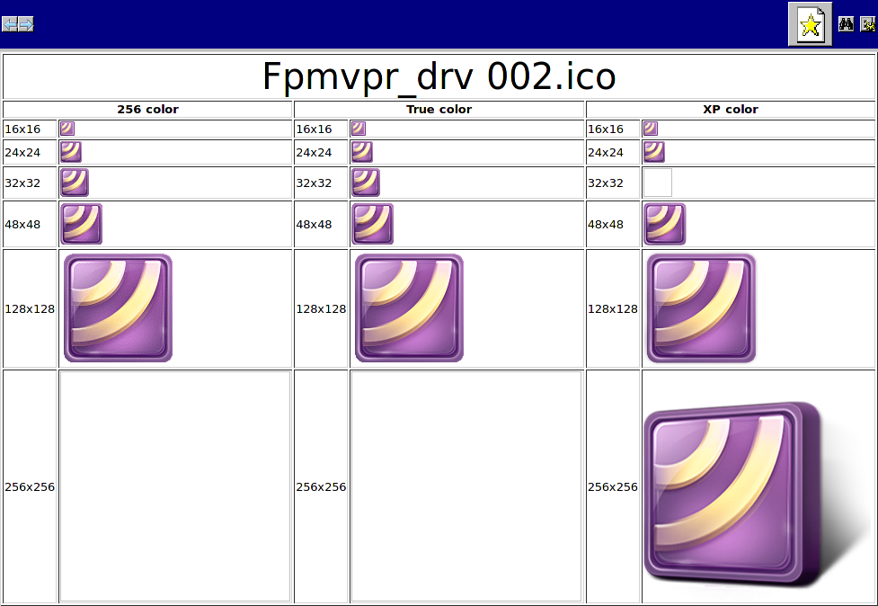

# Useful Scripts  
Some useful scripts written for myself. Maybe will be useful for you too.

## [Test Colors](test_colors.awk "test_colors.awk")
AWK script. Makes test of different color output of awk print.<br>
Syntax:<br>
`echo "text"|awk -f ./test_colors.awk`<br>
or:<br>
`echo "text"|./test_colors.awk`<br>
or:<br>
`./test_colors.awk <<< "text"`<br>
or:<br>
`awk -f ./test_colors.awk <<< "text"`<br>
*Screenshot:*<br>
<br>

## [Undivide](undivide.bc)
Script written on arithmetical **BC** language for finding a closest dividing operation, that can make a floating point number.<br>For running directly -- just make script executable by: "`$chmod +x undivide.bc`", and edit variables: 'count', 'number' and 'afterdot'.<br>Usage in bash scripts:
```
#!/bin/bash
count=2000 #how many multipliers to test with number
number=3.14159265358979323846264338327950288419716939937508 #our number
afterdot=8 #limit of digits after dot
bc -q <<< $(sed 's/^count=.*$/count='$count'/g;s/^number=.*$/number='$number'/g;s/^afterdot=.*$/afterdot='$afterdot'/g;' ./undivide.bc)
```
## [Array Tree](arraytree.awk)
GNU AWK script for exploring contents of a multi-dimensional associative array. How to use: edit the script file, and change the 'ENVIRON' words in `arraytree(ENVIRON,"ENVIRON")` string to the name of your array.<br>
*Screenshot:*<br>


## [Russian Number Endings](rne.awk)
AWK function of obtaining Russian endings (or any parts of word) of numerals, such as: "1 ведро, 2 ведра, 11 вёдер, 1 значок, 2 значка, 11 значков и т. д."<br> How to use:
```
#!/usr/bin/gawk -f
@include "rne.awk"
BEGIN{
 for (vedra=0; vedra<=21; vedra++){
  print "Баба несёт " vedra " пуст" rne(vedra,"ое","ых","ых") " в" rne(vedra,"е","е","ё") "д" rne(vedra,"ро","ра","ер") "."
 }
}
```
Output:<br>

## [Icon Table](icontable.awk)
An AWK script, that opens MS Windows® *.ico* files as HTML-tables.<br>
Needed "icoutils" package as dependency.<br>
*Screenshot*<br>
<br>
